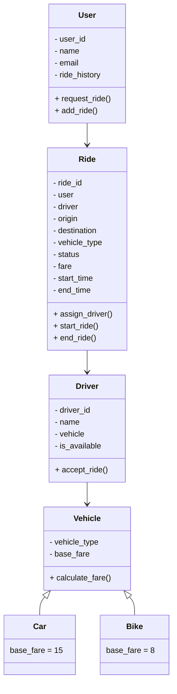

# Ride Sharing System
A simplified ride-sharing system built with Python using Object-Oriented Programming principles.  
This project demonstrates the use of classes, inheritance, polymorphism, encapsulation, and clean architecture.  

## Features

- User registration and ride requests  
- Driver registration and ride acceptance  
- Vehicle types with different fare calculation (Car, Bike, etc.)  
- Ride lifecycle: Requested → Accepted → Ongoing → Completed  
- Ride history for users  
- Extendable to include payments, ratings, and admin dashboards  

## Tech Stack

- **Python 3.9+**  
- Object-Oriented Programming (OOP) principles  
- JSON for data persistence (can be extended to databases)  
- Unit tests with `unittest` 
  
## Getting Started

### 1. Clone the Repository
```bash
git clone https://github.com/aarongeb/ride_sharing_system.git
cd ride_sharing_system
```
### 2. Run the Project
```bash
python main.py
```

## License
This project is licensed under the MIT License - see the [LICENSE](LICENSE) file for details.